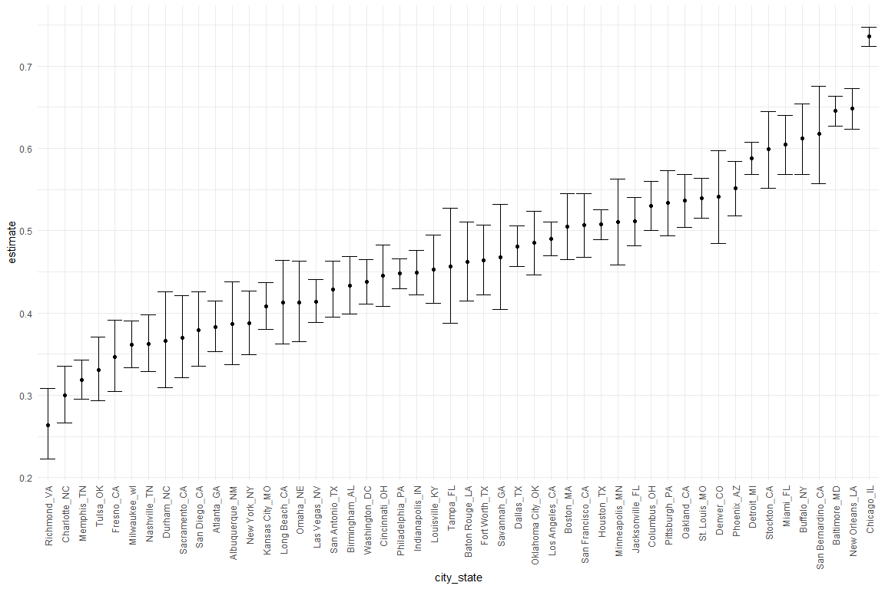
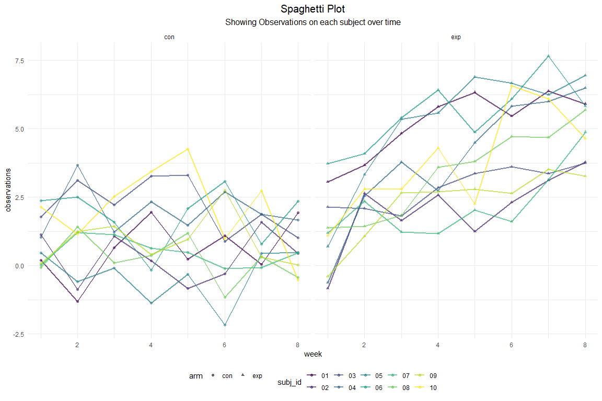

p8105\_hw5\_zl2977
================
Zhourong Li zl2977
2020/11/16

## Problem 1

Read in the data.

``` r
homicide_df = 
  read_csv("./data/homicide-data.csv") %>% 
  mutate(
    city_state = str_c(city, state, sep = "_"),
    resolved = case_when(
      disposition == "Closed without arrest" ~ "unsolved",
      disposition == "Open/No arrest"        ~ "unsolved",
      disposition == "Closed by arrest"      ~ "solved",
    )
  ) %>% 
  select(city_state, resolved) %>% 
  filter(city_state != "Tulsa_AL")
```

    ## Parsed with column specification:
    ## cols(
    ##   uid = col_character(),
    ##   reported_date = col_double(),
    ##   victim_last = col_character(),
    ##   victim_first = col_character(),
    ##   victim_race = col_character(),
    ##   victim_age = col_character(),
    ##   victim_sex = col_character(),
    ##   city = col_character(),
    ##   state = col_character(),
    ##   lat = col_double(),
    ##   lon = col_double(),
    ##   disposition = col_character()
    ## )

Let’s look at this a bit

``` r
aggregate_df = 
  homicide_df %>% 
  group_by(city_state) %>% 
  summarize(
    hom_total = n(),
    hom_unsolved = sum(resolved == "unsolved")
  )
```

    ## `summarise()` ungrouping output (override with `.groups` argument)

Can I do a prop test for a single city?

``` r
prop.test(
  aggregate_df %>% filter(city_state == "Baltimore_MD") %>% pull(hom_unsolved), 
  aggregate_df %>% filter(city_state == "Baltimore_MD") %>% pull(hom_total)) %>% 
  broom::tidy()
```

    ## # A tibble: 1 x 8
    ##   estimate statistic  p.value parameter conf.low conf.high method    alternative
    ##      <dbl>     <dbl>    <dbl>     <int>    <dbl>     <dbl> <chr>     <chr>      
    ## 1    0.646      239. 6.46e-54         1    0.628     0.663 1-sample~ two.sided

Try to iterate ……..

``` r
results_df = 
  aggregate_df %>% 
  mutate(
    prop_tests = map2(.x = hom_unsolved, .y = hom_total, ~prop.test(x = .x, n = .y)),
    tidy_tests = map(.x = prop_tests, ~broom::tidy(.x))
  ) %>% 
  select(-prop_tests) %>% 
  unnest(tidy_tests) %>% 
  select(city_state, estimate, conf.low, conf.high)
```

``` r
results_df %>% 
  mutate(city_state = fct_reorder(city_state, estimate)) %>% 
  ggplot(aes(x = city_state, y = estimate)) +
  geom_point() + 
  geom_errorbar(aes(ymin = conf.low, ymax = conf.high)) + 
  theme(axis.text.x = element_text(angle = 90, vjust = 0.5, hjust = 1))
```



## Problem 2

Create a tidy dataframe containing data from all participants, including
the subject ID, arm, and observations over time.

``` r
study_df=
  tibble(
    file_names = list.files("data/p2-data/"),
    file_paths = str_c("data/p2-data/", file_names)
    )%>%
  mutate(
    data = map(file_paths, read_csv)
    )%>% #now unnest and tidy the result
  unnest(data)%>%
  separate(
    file_names, into = c("arm", "subj_id"), sep = "_"
    )%>%
  mutate(
    subj_id = str_remove(subj_id, ".csv")
    )%>%
  pivot_longer(
    week_1:week_8,
    names_to = "week",
    values_to = "observations",
    names_prefix = "week_"
    )%>%
  mutate(
    week = as.numeric(week)
         )%>%
  select(arm, subj_id, week, observations)
  
study_df %>%
  head(10) %>% #show first 10 rows of the table
  knitr::kable()
```

| arm | subj\_id | week | observations |
| :-- | :------- | ---: | -----------: |
| con | 01       |    1 |         0.20 |
| con | 01       |    2 |       \-1.31 |
| con | 01       |    3 |         0.66 |
| con | 01       |    4 |         1.96 |
| con | 01       |    5 |         0.23 |
| con | 01       |    6 |         1.09 |
| con | 01       |    7 |         0.05 |
| con | 01       |    8 |         1.94 |
| con | 02       |    1 |         1.13 |
| con | 02       |    2 |       \-0.88 |

Make a spaghetti plot showing observations on each subject over time,
and comment on differences between groups.

``` r
study_df%>%
  ggplot(aes(x = week, y = observations, group = subj_id, color = subj_id))+
  geom_line(size = .8, alpha = .7) + 
  geom_point(size = 1.5, alpha = .6, aes(shape = arm)) +
  facet_grid(~arm) +
  labs(title = "Spaghetti Plot",
       subtitle = "Showing Observations on each subject over time", 
       x = "week",
       y = "observations")
```



From the spaghetti plot above, we can see both arms have approximate
observation values at beginning, the observation values in the control
group do not change much over time, while the observation values in the
experimental group increase over time.

## Problem 3

Create a function that produced data from normal distribution as
required and conduct t-test.

``` r
sim_test=function(n = 30, mu = 0, sigma = 5){
  if (!is.numeric(mu)) {
    stop("Argument mean should be numeric")}
  sim_data =tibble(
    rnorm(n, mean = mu, sd = sigma)
  )
  test_result = t.test(sim_data, mu=0, conf.level = 0.95)
  sim_data %>%
    summarize(
    mu_hat =pull(broom::tidy(test_result),estimate),
    p_val = pull(broom::tidy(test_result),p.value)
    )
} 
```

Generate 5000 datasets for each `mu` by calling the function. Obtain the
required estimates and p-values.

``` r
sim_results=
  tibble(true_mu=c(0,1,2,3,4,5,6))%>% # first mu=0, then repeat for mu=1,2,3,4,5,6
  mutate(
    output_lists = map(.x=true_mu,~rerun(5000,sim_test(mu=.x))),
    estimate_dfs = map(output_lists, bind_rows)
  )%>%
  select(
    -output_lists
  )%>%
  unnest(estimate_dfs)
```

Make a plot showing the proportion of times the null was rejected (the
power of the test) on the y axis and the true value of μ on the x axis.

``` r
sim_results %>%
  group_by(true_mu)%>%
  mutate(
    true_mu = as.factor(true_mu),
    rej = as.numeric(p_val < 0.05)
  ) %>%
  summarize(
    power=mean(rej)
  ) %>%
  ggplot(aes(x=true_mu, y =power, color = true_mu, group = true_mu))+
  ggtitle("The Power of the Tests")+
  scale_y_continuous(n.breaks = 10) +
  geom_point(size = 5, alpha = .6)+
  xlab("true value of mu")
```


From the above graph we can see the power (the proportion of times the
null was rejected) increases as the effect size of true mu increases.
The power starts very close to 0.05 (which is our `alpha` value) when
the true `mu` = 0, and then gradually approaches 1 as the the true `mu`
increases towards 6.

``` r
est_all_mu_hat=
  sim_results %>%
  group_by(
    true_mu
  )%>%
  summarize(
    ave_mu_hat=mean(mu_hat)
  )%>%
  mutate(type = "all_mu_hat")
```

``` r
est_rej_mu_hat=
  sim_results %>%
  group_by(
    true_mu
  )%>%
  filter(
    p_val<0.05
  )%>%
  summarize(
    ave_mu_hat=mean(mu_hat)
  )%>%
  mutate(type = "rej_mu_hat")
```

``` r
bind_rows(est_all_mu_hat, est_rej_mu_hat) %>%
   ggplot(aes(x=true_mu, y =ave_mu_hat, color=type))+
   ggtitle("Average Estimate Mean vs True Mean")+
   geom_point()+
   geom_path(size=3, alpha=0.5)+
   scale_x_continuous(n.breaks = 7) +
   scale_y_continuous(n.breaks = 7) +
   ylab("average estimate")+
   xlab("true value of mu")
```


As the above plot shows, the sample averages of all estimated `mu_hat`
are approximately equal to the true `mu`. While the sample averages of
`mu_hat` across tests for which the null is rejected are not
approximated equal to the true `mu`.

Because `rej_mu_hat` contains `mu_hat` only in samples for which null
was rejected, it appears more far away from the null comparing with the
values of `all_mu_hat` since `all_mu_hat` also contains samples which
were failed to reject. Therefore the values of `all_mu_hat` are
represented closer to the true `mu` values.

When the true `mu` are small, only the estimates that are significant
far way from the null can be rejected, thus the average of these
significantly far way estimates appeared much greater than the average
of all estimates (except true `mu` = 0 because in this case the rejected
estimates appeared by equal chance in both sides of the null = 0, the
average of these rejected estimates thus close to the true `mu`).

However, when the true `mu` increases, the majority of the estimates
moved far away from the null, in other words, the majority of the
estimates were being rejected, thus the difference of average between
all estimates and estimates being rejected became smaller, resulting two
lines got closer and closer as true values of `mu` increased.
